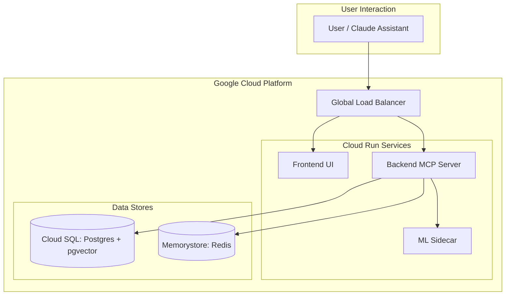

# Evolutionary Memory MCP Server

## 1. Project Overview

This project is an **Evolutionary Memory MCP (Model Context Protocol) server** designed to provide AI assistants like Claude with robust short-term and long-term memory. It features feedback-driven learning and context anchoring, allowing the system's knowledge base to grow and adapt alongside the business it supports.

The core purpose is to create a persistent, evolving memory layer that enhances AI interactions by:

- **Remembering** key information from conversations.
- **Recalling** relevant context on demand using semantic search.
- **Learning** from user feedback to improve the confidence and accuracy of its memories.
- **Anchoring** critical business concepts to ensure they are always prioritized in recall.

## 2. Design & Architecture

The system uses a powerful and flexible hybrid architecture that separates high-performance request handling from computationally intensive machine learning tasks.

### Core Components

- **Go Backend (`/backend`)**: The "Brain" of the operation. It's a high-performance Go application that handles:
- The MCP server endpoint for the AI assistant.
- API routing and business logic for all memory operations.
- CRUD operations for short-term (Redis) and long-term (PostgreSQL) memory stores.
- Coordination with the Python ML sidecar for embedding and similarity tasks.

- **Python ML Sidecar (`/ml-sidecar`)**: The "Subconscious." This FastAPI service handles all heavy machine learning tasks, keeping the Go backend lean and fast. Its responsibilities include:
- Generating vector embeddings from text for semantic search.
- Calculating semantic similarity between queries and stored memories.
- Handling feedback-driven model adaptation and training jobs.

- **Vite Frontend (`/frontend`)**: The "Dashboard." A React-based single-page application that provides a human-in-the-loop interface for:
- Visualizing memory graphs and confidence scores.
- Managing and auditing context anchors.
- Manually providing feedback or corrections to memories.

### Technology Stack

| Layer | Technology | Purpose |
| --- | --- | --- |
| **MCP Server** | Go 1.26+ | Primary runtime for business logic and API |
| **Short-Term Memory** | Redis 7+ | Session-scoped context with a TTL |
| **Long-Term Memory** | PostgreSQL 16+ (with `pgvector` and `pg_trgm` extensions) | Persistent storage for memories, anchors, and feedback, with vector and fuzzy search capabilities. |
| **Embeddings / ML** | Python 3.11, FastAPI, `sentence-transformers` | Vector generation and semantic similarity |
| **Frontend** | React 18, Vite, TailwindCSS | Dashboard and management UI |
| **Orchestration** | Docker Compose | Local development environment |
| **Deployment** | Docker, Google Cloud Run | Target production environment |

### System Architecture (GCP)

The application is designed to be deployed as a set of containerized, serverless components on Google Cloud.



## 3. Getting Started

Follow these steps to set up your local development environment and run the application.

### Prerequisites

- Docker and Docker Compose
- Go (version 1.26 or later)
- Python (version 3.11 or later)
- Node.js and npm

### 1. Clone the Repository

```sh
git clone <repository-url>
cd evolutionary-mcp
```

### 2. Configure Environment Variables

Copy the example environment file and customize it as needed.

```sh
cp .env.example .env
```

At a minimum, ensure the `DATABASE_URL` and `REDIS_URL` point to the services that will be started by Docker Compose. The default values are typically sufficient for local development.

### 3. Build and Run the Application

The easiest way to start the development environment is via the provided `Makefile`.

```sh
# bring up Postgres & Redis, then launch the Go backend locally
make run
```

Under the hood `make run` spins up the `postgres` and `redis` containers and
waits for the database to be ready before running `go run ./backend/cmd/server`.
If Docker or the image pull fails you'll see a helpful error message and the
Makefile will exit; in that case either fix your Docker installation or start
Postgres/Redis manually and ensure the connection parameters in
`config.yaml` or environment variables point to a running instance.

Alternatively you can bring up the full compose stack (including frontend and
ml-sidecar) with:

```sh
docker-compose up --build -d
```

- The Go backend will be available on port `8080` (or `8443` if TLS is
  enabled).
- The Python ML sidecar will be available on port `8001`.
- The frontend runs on port `3000`.

### 4. Run the Frontend

In a separate terminal, navigate to the `frontend` directory to install dependencies and start the Vite development server.

```sh
cd frontend
npm install
npm run dev
```

The frontend dashboard will be available at `http://localhost:3000`.

### 5. Verify Installation

Once all services are running, you can connect your AI assistant (e.g., Claude Desktop) to the local MCP server. Configure the assistant to point to the memory server, typically by updating its local MCP settings to use the command for the running backend process.

You can verify the connection by asking the assistant to use one of the memory tools, such as `list_anchors`.

## 6. Authentication (Okta OAuth)

The backend supports user authentication via Okta using a dual-client architecture to support both server-side and browser-based flows securely.

1. **Create Okta Applications**
   - **Backend App**: Create a "Web Application".
     - *Redirect URI*: `http://localhost:8080/auth/callback`
     - Note the *Client ID* and *Client Secret*.
   - **Frontend App**: Create a "Single Page App (SPA)".
     - *Redirect URI*: `http://localhost:8080/docs/oauth2-redirect.html`
     - Enable **PKCE**.
     - Note the *Client ID* (no secret required).

2. **Update Configuration**
   - Add the Okta issuer URL and credentials to `config.yaml`.
     ```yaml
     auth:
       # full issuer URL, e.g. "https://dev-123456.okta.com/oauth2/default"
       okta_domain: "https://dev-123456.okta.com/oauth2/default"
       client_id: "BACKEND_WEB_APP_CLIENT_ID"
       client_secret: "BACKEND_WEB_APP_CLIENT_SECRET"
       # New field for Swagger/SPA:
       swagger_client_id: "FRONTEND_SPA_CLIENT_ID"
       redirect_url: "http://localhost:8080/auth/callback"
     ```
   - The backend will read and normalize these values on startup.

3. **Using the Frontend**
   - Navigate to the frontend UI (e.g. `http://localhost:3000`).
   - Click the **Login with Okta** button. You will be redirected to Okta to sign in.
   - After successful authentication you’ll be returned to the dashboard with a session cookie set.
   - Use the **Logout** button to clear the session.

4. **Swagger / OpenAPI Docs**
   - A Swagger UI is available at `http://localhost:8080/docs`.
   - The UI loads the OpenAPI spec from `/openapi.yaml` and includes an **Authorize** button.
   - The **Swagger Client ID** is injected automatically. It uses PKCE, so no client secret is required or sent.
   - Click **Authorize** to redirect to Okta for login.
   - After authorizing, all requests made from the UI will include the access token.
   - A read‑only text box above the Swagger UI will also show the raw Bearer token; you can copy/paste it to share with other users or for manual API calls.
   - Ensure your Okta application’s allowed redirect URLs include
     `http://localhost:8080/docs/oauth2-redirect.html`.

5. **API Access**
   - Any requests to `/mcp/*` paths require an authenticated user. Unauthenticated requests will be redirected to `/login`.
   - You can test by hitting `http://localhost:8080/api/v1/health` with credentials included; a 200 response indicates a valid session.

## 7. TLS Support

The backend can run with HTTPS on port 8443 using certificates provided in the
configuration. This is especially useful when embedding the service into a
secure environment or using the Swagger UI’s OAuth flow over TLS.

### Enable TLS

1. Set the `tls.enable` field to `true` and provide paths for
   `cert_file` and `key_file` in `config.yaml` or via environment variables.
   You can also supply an array of `hostnames` which will be used when
generating a self-signed certificate automatically.

2. When `tls.enable` is true and the certificate/key files are missing,
   the server will attempt to generate a self-signed certificate using the
   `internal/tls` helper. By default it will write to the provided paths and
   include any hostnames you list (e.g. `localhost`, `127.0.0.1`).

3. The server will start on `https://localhost:8443`.  If you prefer to use
   a custom port, set `Server.Addr` accordingly in the code or extend the
   configuration.

### Generating Self‑Signed Certs Manually

You can also generate a certificate ahead of time using the library in a small
Go program or a CLI tool. Example:

```go
package main

import (
    "log"
    "evolutionary-mcp/backend/internal/tls"
)

func main() {
    // include whichever hostnames you will use when accessing the service
    if err := tls.GenerateSelfSignedCert("server.crt", "server.key", []string{"localhost", "127.0.0.1", "vdatacloud.com"}); err != nil {
        log.Fatal(err)
    }
}
```

Build and run this program once; the files will be created in the current
working directory.

> **Tip:** if you own a real domain such as `vdatacloud.com`, point it at
> `127.0.0.1` (for example by adding a `/etc/hosts` entry) so that browsers and
tools resolve it locally but still present the same hostname to the TLS
certificate.  You can then hit `https://vdatacloud.com:8443` in your browser
and the certificate will already contain that name.

Alternatively, you can use [`mkcert`](https://github.com/FiloSottile/mkcert)
since it automates trust for development but the built‑in helper avoids any
external dependencies.

### Notes

- The Swagger UI and login callbacks will also operate over HTTPS when TLS is
  enabled.
- Be aware that browsers will warn about self-signed certificates; add an
  exception for development or install the cert into your trust store if
  desired.

> **Production tip:** since `vdatacloudai.com` is registered through Cloudflare,
> you can leverage Cloudflare’s TLS/Edge certificates, CDN, and security
> features when you flip the site to public.  Cloudflare will handle valid
> certificates on your behalf and can also proxy requests back to your
> containerized backend running on Cloud Run or elsewhere.
