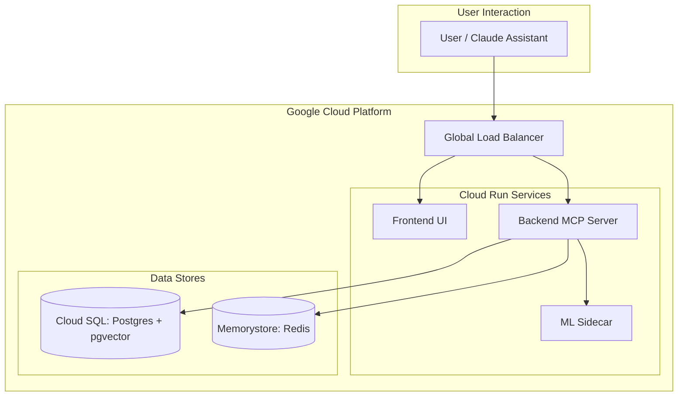

# Evolutionary Memory MCP Server

## 1. Project Overview

This project is an **Evolutionary Memory MCP (Model Context Protocol) server** designed to provide AI assistants like Claude with robust short-term and long-term memory. It features feedback-driven learning and context anchoring, allowing the system's knowledge base to grow and adapt alongside the business it supports.

The core purpose is to create a persistent, evolving memory layer that enhances AI interactions by:

- **Remembering** key information from conversations.
- **Recalling** relevant context on demand using semantic search.
- **Learning** from user feedback to improve the confidence and accuracy of its memories.
- **Anchoring** critical business concepts to ensure they are always prioritized in recall.

## 2. Design & Architecture

The system uses a powerful and flexible hybrid architecture that separates high-performance request handling from computationally intensive machine learning tasks.

### Core Components

- **Go Backend (`/backend`)**: The "Brain" of the operation. It's a high-performance Go application that handles:
- The MCP server endpoint for the AI assistant.
- API routing and business logic for all memory operations.
- CRUD operations for short-term (Redis) and long-term (PostgreSQL) memory stores.
- Coordination with the Python ML sidecar for embedding and similarity tasks.

- **Python ML Sidecar (`/ml-sidecar`)**: The "Subconscious." This FastAPI service handles all heavy machine learning tasks, keeping the Go backend lean and fast. Its responsibilities include:
- Generating vector embeddings from text for semantic search.
- Calculating semantic similarity between queries and stored memories.
- Handling feedback-driven model adaptation and training jobs.

- **Vite Frontend (`/frontend`)**: The "Dashboard." A React-based single-page application that provides a human-in-the-loop interface for:
- Visualizing memory graphs and confidence scores.
- Managing and auditing context anchors.
- Manually providing feedback or corrections to memories.

### Technology Stack

| Layer | Technology | Purpose |
| --- | --- | --- |
| **MCP Server** | Go 1.26+ | Primary runtime for business logic and API |
| **Short-Term Memory** | Redis 7+ | Session-scoped context with a TTL |
| **Long-Term Memory** | PostgreSQL 16+ (with `pgvector` and `pg_trgm` extensions) | Persistent storage for memories, anchors, and feedback, with vector and fuzzy search capabilities. |
| **Embeddings / ML** | Python 3.11, FastAPI, `sentence-transformers` | Vector generation and semantic similarity |
| **Frontend** | React 18, Vite, TailwindCSS | Dashboard and management UI |
| **Orchestration** | Docker Compose | Local development environment |
| **Deployment** | Docker, Google Cloud Run | Target production environment |

### System Architecture (GCP)

The application is designed to be deployed as a set of containerized, serverless components on Google Cloud.



## 3. Getting Started

Follow these steps to set up your local development environment and run the application.

### Prerequisites

- Docker and Docker Compose
- Go (version 1.26 or later)
- Python (version 3.11 or later)
- Node.js and npm

### 1. Clone the Repository

```sh
git clone <repository-url>
cd evolutionary-mcp
```

### 2. Configure Environment Variables

Copy the example environment file and customize it as needed.

```sh
cp .env.example .env
```

At a minimum, ensure the `DATABASE_URL` and `REDIS_URL` point to the services that will be started by Docker Compose. The default values are typically sufficient for local development.

### 3. Build and Run the Application

The entire stack can be launched using Docker Compose. This will start the Go backend, the Python ML sidecar, a PostgreSQL database with `pgvector`, and a Redis instance.

```sh
docker-compose up --build -d
```

- The Go backend will be available on port `8080`.
- The Python ML sidecar will be available on port `8001`.

### 4. Run the Frontend

In a separate terminal, navigate to the `frontend` directory to install dependencies and start the Vite development server.

```sh
cd frontend
npm install
npm run dev
```

The frontend dashboard will be available at `http://localhost:3000`.

### 5. Verify Installation

Once all services are running, you can connect your AI assistant (e.g., Claude Desktop) to the local MCP server. Configure the assistant to point to the memory server, typically by updating its local MCP settings to use the command for the running backend process.

You can verify the connection by asking the assistant to use one of the memory tools, such as `list_anchors`.
